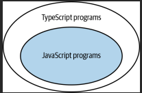
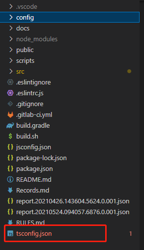
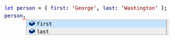
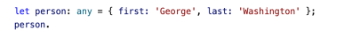

# TypeScript

::: tip 提示
`TypeScript`作为一种语言有点不寻常，因为它既不在解释器中运行（像 Python 和 Ruby 那样），也不能编译较低级别的语言（如 Java 和 C）。相反，它编译成另一种高级语言 JavaScript。运行的是这个 JavaScript，而不是您的 TypeScript。所以 TypeScript 与 JavaScript 的关系是必要的。
:::

## 1.1、TypeScript 和 JavaScript 的关系

### 1.1.1、TypeScript 是 JavaScript 的超集

_在语法意义上，它是 JavaScript 的超集：只要您的 JavaScript 程序没有任何语法错误，那么它也是一个 TypeScript 程序。TypeScript 的类型检查器可能会标记代码中的一些问题，将解析代码并发出 JavaScript。_

_TypeScript 文件使用.ts（或.tsx）扩展名，而不是 JavaScript 文件的.js（或.jsx）扩展名。这并不意味着 `TypeScript`是一种完全不同的语言！由于 TypeScript 是 JavaScript 的一个超集，所以您的.js 文件中的代码已经是`TypeScript`了。_

<font color="#dd0000">所有的 JavaScript 程序都是 TypeScript 程序，但一些 TypeScript 程序 并不是 JavaScript 程序。</font>这是因为`TypeScript`为指定类型添加了额外的语法。

```ts
function greet(who: string) {
  console.log("Hello", who);
}
```

但是当你通过一个需要 `JavaScript` 的程序来运行它时，你会得到一个错误：

```ts
    function greet(who: string) {
                     ^
    SyntaxError: Unexpected token :
```

字符串是一种特定于 `TypeScript` 的类型注释。一旦您使用了这个，您就已经超越了普通的 JavaScript（参见图）

<div style="display: flex; justify-content: center;">
    
</div>

这并不是说 `TypeScript` 没有为普通的`JavaScript`程序提供值。例如，这个 `JavaScript` 程序:

```sh
    let city = 'new york city';
    console.log(city.toUppercase());

    # Property 'toUppercase' does not exist on type 'string'. Did you mean 'toUpperCase'?
```

你运行时将抛出一个错误: <font color="#dd0000">_TypeError: city.toUppercase is not a function_</font>

在这个程序中没有类型注释，但是`TypeScript`的类型检查器仍然能够发现问题，你不必告诉 TypeScript 关于 ‘city’ 的类型是字符串，它从初始值就可以推断出它， <font color="#dd0000">类型推理是 TypeScript 的 关键部分。</font>

## 1.2、了解你正在使用的 TypeScript 选项

TS 有丰富的配置选项，接下来我们就来编写 TS 配置文件。我们在项目最外层新建 TS 配置文件 `tsconfig.json`。(_TypeScript 的配置设置控制着它查找源文件的位置以及它生成的输出类型。_)

<div style="display: flex; justify-content: center;">
    
</div>

```sh
"compilerOptions": {
    "target": "ESNext", // 编译转换的js版本（ESNext 是指ECMAScript 的下一个版本，包括ES6的语法）
    "module": "ESNext", // 编译转化的模块化标准
    "lib": ["DOM", "ESNext"],, // 指定了项目中需要使用的库，一般不进行修改
    "noImplicitAny": true,  //不允许使用隐式any类型，默认为false
    "strictNullChecks": true,  //检查元素是否为空，默认为false
    "noImplicitThis": true, // 禁用指向不明确的this，默认为false
    "allowJs": false, // 是否对js进行编译，默认为false
    "alwaysStrict": false, //设置编译后js是否开启严格模式，默认为false
    "strict": true, // 严格状态开启，默认为false
},
```

## 1.3、了解代码生成与类型无关

在高级上，`tsc`（typeScript 编译器）会做两件事：

- 它将下一代 TypeScript/JavaScript 转换为可以在浏览器中工作的旧版本的 JavaScript。
- 它会检查代码中的类型错误。

令人惊讶的是，这两种行为是完全相互独立的。换句话说，代码中的类型不会影响 TypeScript 到 JavaScript 的编译过程。由于 JavaScript 是可执行的，这就意味着类型不能影响代码的运行方式。

### 1.3.1、带有类型错误的代码可以产生输出

带有类型错误的代码可以产生输出。由于代码输出与类型检查无关，因此有类型错误的代码可以产生输出。

```sh
    let x = 'hello';
    x = 1234;
    $ tsc test.ts
    test.ts:2:1 - error TS2322: Type '1234' is not assignable to type 'string'

```

当你提交代码的时候你的目标是零错误，以免落入必须记住预料之中或意外的错误。如果你希望禁止错误输出，可以在 tsconfig.json 中使用 noEmitOnErrors 选项，或者在构建工具中使用类似选项。

### 1.3.2、不能在运行时检查 TS 类型

::: tip 提示
`运行时类型检查（静态类型检查）：`在编译阶段对变量类型进行静态检查，编译后的代码不保留任何类型标注信息，对实际代码运行没有影响。
:::

你可能会写这样一段代码：

```ts
interface Square {
  width: number;
}
interface Rectangle extends Square {
  height: number;
}
type Shape = Square | Rectangle;
function calculateArea(shape: Shape) {
  if (shape instanceof Rectangle) {
    // ~~~~~~~~~ 'Rectangle' only refers to a type,
    // but is being used as a value here
    return shape.width * shape.height;
    // ~~~~~~ Property 'height' does not exist
    // on type 'Shape'
  } else {
    return shape.width * shape.width;
  }
}
```

`Instanceof` 的检查发生在运行时，但是 `Rectangle` 是一个类型，因此它不会影响代码的运行时行为。类型是“可删除的”： 编译到 JavaScript 的部分会被简单地从代码中删除所有的接口、类型和类型注释。

为了确定要处理的类型的形状，你需要一些方法能在运行时重构它的类型。在这种情况下，你可以检查 `height` 属性是否存在。

```ts
function calculateArea(shape: Shape) {
  if ("height" in shape) {
    shape; // Type is Rectangle
    return shape.width * shape.height;
  } else {
    shape; // Type is Square
    return shape.width * shape.width;
  }
}
```

这是起作用的，因为属性检查只涉及在运行时可用的值，但仍允许类型检查器把 shape 的类型细化为 Rectangle。

另一种方法引入一个 `tag`，以运行时可用的方法显式存储类型：

```ts
interface Square {
  kind: "square";
  width: number;
}
interface Rectangle {
  kind: "rectangle";
  height: number;
  width: number;
}
type Shape = Square | Rectangle;
function calculateArea(shape: Shape) {
  if (shape.kind === "rectangle") {
    shape; // Type is Rectangle
    return shape.width * shape.height;
  } else {
    shape; // Type is Square
    return shape.width * shape.width;
  }
}
```

这里的 Shape 类型是被标记的联合类型（tagged union）的一个例子。因为这种方法使得在运行时恢复类型信息变得非常容易，所以标记联合类型在 TypeScript 中是无处不在。

### 1.3.3、类型操作不能影响运行中的值

假设你有一个值，可以是一个字符串或一个数字，你想把它正规化，这样它就总是一个数字。下面是类型检查器所接受的一个错误的尝试：

```ts
function asNumber(val: number | string): number {
  return val as number;
}
```

代码运行后没有任何转化发生。`as number` 是一种类型操作，所以它是不能影响代码的运行时行为。为了规范化这个值，你需要检查它的运行时类型并使用 JavaScript 结构进行转换，如下:

```ts
function asNumber(val: number | string): number {
  return typeof val === "string" ? Number(val) : val;
}
```

### 1.3.4、TS 类型对运行时性能没有影响

::: tip 提示
类型和类型操作在生成 JavaScript 时会被删除，所以它们不会对运行时性能产生影响。TS 的静态类型确实是零成本。
:::

代码生成独立于类型系统。这意味着 TS 类型不会影响代码的运行时行为或性能。

## 1.4、熟悉结构类型

::: warning
`JavaScript`本质上是`duck`类型的：是动态类型的一种风格。简单地说，如果你向函数传递一个具有所有正确属性的值，它不会关心你是如何生成值的，它只会使用它。（“如果它像鸭子一样走路，说话像鸭子……”）TypeScript 模拟了这种行为，有时它可以导致令人惊讶的结果，因为类型检查器对类型的理解可能是比你想的要宽泛。对结构类型有很好的把握帮助你理解错误和非错误，并帮助你编写更健壮的代码。
:::

假设你正在开发一个物理库，并且有一个 `Vector2D` 类型：

```ts
interface Vector2D {
  x: number;
  y: number;
}
```

编写一个函数来计算长度

```ts
function calculateLength(v: Vector2D) {
  return Math.sqrt(v.x * v.x + v.y * v.y);
}
```

现在你又引入了一个命名向量的概念：

```ts
interface NamedVector {
  name: string;
  x: number;
  y: number;
}
```

计算长度函数将与名称向量一起工作，因为它们都有 x 和 y 属性，`TypeScript` 足够聪明，可以弄明白这一点：

```ts
const v: NamedVector = { x: 3, y: 4, name: "Zee" };
calculateLength(v); // OK, result is 5
```

虽然你没有声明 `Vector2D` 和 `NamedVector` 之间的关系，但是 TypeScript 的类型系统正在对 JavaScript 的运行时行为进行建模，它允许用 `NamedVector` 调用计算长度，因为它的结构与 `Vector2D` 兼容。这就是术语<font color="#dd0000">“ 结构性类型 ”</font>的来源。

## 1.5、限制 any 类型的使用

::: tip 提示
`TypeScript`的类型系统是 _渐进的_ 和 _可选的_ ：

渐进的：你可以逐个添加类型到代码中；

可选的：你可以在任何时候禁用类型检查器。
:::

```ts
let age: number;
age = "12";
// ~~~ Type '"12"' is not assignable to type 'number'
age = "12" as any; // OK
```

类型检查器此时的提示是正确的，但是你也可以通过 `any` 类型来强制输入。 `any`类型 会消除 TypeScript 的许多优点，在使用时，你应该清楚了解它的作用跟危害。

### 1.5.1、 任何类型都没有类型安全

在前面的示例中，类型声明表示年龄是一个数字。但 `any` 让你可以为它分配一个字符串。类型检查器会认为它是一个数字（毕竟这是你说的），混乱就会消失不见：

```sh
age += 1; // OK; at runtime, age is now "121"
```

### 1.5.2、 any 会让你打破约定

当你编写一个函数时，你正在指定一个约定：如果调用者给你一个确定类型的输入，你将产生特定类型的输出。但对于任何类型，你可以打破这些约定：

```ts
function calculateAge(birthDate: Date): number {
  // ...
}
let birthDate: any = "1990-01-19";
calculateAge(birthDate); // OK
```

出生日期参数应该是“日期”，而不是字符串。任何类型会让你打破定义方法的约定。这可能会产生一些问题，因为 JavaScript 通常会在类型之间进行隐式转换。字符串有时会在预期为数字的情况下工作，但在其他情况下会中断。

### 1.5.3、 any 类型没有语言服务

当元素具有类型时，TypeScript 语言服务能够提供自动完成和上下文文档：

<div style="display: flex; justify-content: center;">
    
</div>

但是 `any` 类型，不会进行补全提示：

<div style="display: flex; justify-content: center;">
    
</div>

::: warning
`any` 类型破坏了 类型检查器和 TypeScript 语言服务。它掩盖了真正的问题，损害开发人员的经验，并破坏类型系统的信心。尽可能避免使用它！
:::
