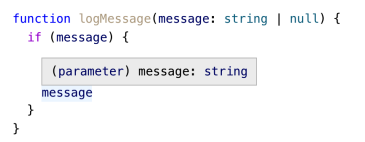
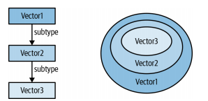
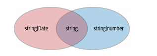

# TypeScript’s Type System

::: tip 提示
TypeScript 的类型系统非常强大，能够表达出你可能想象不到的类型。
:::

## 2.1、使用你的编辑器来探索类型系统

你可以将鼠标放到元素上，TypeScript 会自动推断它的类型（参见下图），虽然你没有为这个变量定义为：数字类型，但是 `TypeScript` 能够根据值推断出来。

<div style="display: flex; justify-content: center;">
    
</div>

_查看`TypeScript`在任何给定点上对变量类型的理解对于建立一个围绕扩展和缩小的直觉是至关重要的。查看条件分支中变量变化的类型是对类型系统建立信心的一种重要方法（参见图 2)。_

<div style="display: flex; justify-content: center;">
    
</div>

## 2.2、将类型看作值的集合

在运行时，每个变量都有一个从 JavaScript 值的范围中选择的值。可能的值有很多，包括:

- 42
- null
- undefined
- 'Canada'
- {animal: 'Whale', weight_lbs: 40_000}
- /regex/
- new HTMLButtonElement
- (x, y) => x + y

但是在你的代码运行之前，当 TypeScript 检查它的错误时，它只有一个类型。最好把它理解为一组可能的值。这个集合就是定义域的类型。例如，你可以认为 number 类型是所有数值的集合。42 和-37.25 在其中，但“Canada”没有。根据严格的检查，Null 和 undefined 可能是集合的一部分，也可能不是。

最小的集合是空集，它不包含任何值。它对应于 TypeScript 中的`never`类型。因为它的域是空的，所以没有值可以赋值给`never`类型的变量:

```ts
const x: never = 12;
// ~ Type '12' is not assignable to type 'never'
```

下一个最小的集合是那些包含单个值的集合。这些对应于 TypeScript 中的字面量类型，也称为单元类型：

```ts
type A = "A";
type B = "B";
type Twelve = 12;
```

要想形成两个或三个值的类型，你可以进行合并单元类型：

```ts
type AB = "A" | "B";
type AB12 = "A" | "B" | 12;
```

_`assignable` 一词出现在许多 TypeScript 错误中。在值集合的上下文中，它要么是“成员”(指值和类型之间的关系)，要么是“子集”(指两种类型之间的关系)_

```ts
const a: AB = "A"; // OK, value 'A' is a member of the set {'A', 'B'}
const c: AB = "C";
// ~ Type '"C"' is not assignable to type 'AB'
```

类型“C”是单位类型。它的定义域由单个值“C”组成。这不是 AB(由值“A”和“B”组成)的定义域的子集，所以这是一个错误。说到底，几乎所有的类型检查都是在测试一个集合是否是另一个集合的子集：

```ts
const ab: AB = Math.random() < 0.5 ? "A" : "B"; // OK, {"A", "B"} is a subset of {"A", "B"}:
const ab12: AB12 = ab; // OK, {"A", "B"} is a subset of {"A", "B", 12}

declare let twelve: AB12;
const back: AB = twelve; // ~~~~  Type 'AB12' is not assignable to type 'AB'; Type '12' is not assignable to type 'AB'
```

这些类型的集合很容易推理，因为它们是有限的。但在实践中使用的大多数类型都有无限值域。对此的推理可能会更加困难。你可以认为它们是建设性地构建的：

```ts
interface Person {
  name: string;
}
interface Lifespan {
  birth: Date;
  death?: Date;
}
type PersonSpan = Person & Lifespan;
```

&运算符计算两种类型的交集。哪些类型的值属于 `PersonSpan` 类型？乍一看，`Person` 和 `Lifespan` 接口没有共同的属性，所以你可能会认为它是空集合(即 never 类型)。但类型操作适用于值的集合(类型的域)，而不是
接口中的属性。记住，具有附加属性的值仍然属于类型。因此同时具有 `Person` 和 `Lifespan` 属性的值属于交集:

```js
const ps: PersonSpan = {
  name: "Alan Turing",
  birth: new Date("1912/06/23"),
  death: new Date("1954/06/07"),
}; // OK
```

::: warning
当然，一个值可以具有以上三个属性，但仍然属于该类型！一般规则是：交集类型的值包含其每个组成部分属性的并集。
:::

另一种更常用的编写`PersonSpan`类型的方法是使用 `extends`：

```ts
interface Person {
  name: string;
}
interface PersonSpan extends Person {
  birth: Date;
  death?: Date;
}
```

把类型看作值的集合，那么 `extends` 是什么意思呢？就像“assignable to”一样，你可以把它读作“subset of”。`PersonSpan`中的每个值都必须有一个 name 属性，它是一个字符串。每个值都必须有一个 birth 属性，
所以它是一个子集。

你可能会听到“子类型”这个词，也就是说一个集合的定义域是其他集合的子集。以一维、二维和三维向量的方式思考：

```ts
interface Vector1D {
  x: number;
}
interface Vector2D extends Vector1D {
  y: number;
}
interface Vector3D extends Vector2D {
  z: number;
}
```

你会说 Vector3D 是 Vector2D 的子类型，而 Vector2D 是 Vector1D 的子类型(在类的上下文中，你会说“子类”)。这种关系通常绘制成一个层次结构，但从值集的角度考虑，维恩图更合适(见图 2-7)。

<div style="display: flex; justify-content: center;">
    
</div>

当类型之间的关系不是严格的层次关系时，集合解释也更有意义。例如，string|number 和 string|Date 之间是什么关系？它们的交集是非空的(字符串)，但都不是另一个的子集。尽管如此，它们的域之间的关系是明确的，
尽管这些类型不符合严格的层次结构(见图 2-8)。

<div style="display: flex; justify-content: center;">
    
</div>

将类型视为集合还可以阐明数组和元组之间的关系。例如:

```js
const list = [1, 2]; // Type is number[]
const tuple: [number, number] = list;
// ~~~~~ Type 'number[]' is missing the following
// properties from type '[number, number]': 0, 1
```

是否存在非数字对的数字列表？当然！空列表和`list [1]`是例子。因此 number[]不能赋值给[number, number]，这是有道理的，因为它不是[number, number]的子集。(反向赋值是可行的。)

::: warning
最后，值得注意的是，并不是所有的值集都对应于`TypeScript`类型。对于所有的整数，或者只有 x 和 y 属性但没有其他属性的对象，都没有 `TypeScript` 类型。有时你可以使用 `Exclude` 来减去类型，但前提是它会得到
正确的 TypeScript 类型。
:::

```ts
type T = Exclude<string | Date, string | number>; // Type is Date
type NonZeroNums = Exclude<number, 0>; // Type is still just number
```

## 2.3、类型空间或值空间

在 TypeScript 里存在两种声明空间：类型声明空间与变量声明空间。

- Type space
- Value space

```ts
interface Cylinder {
  radius: number;
  height: number;
}
const Cylinder = (radius: number, height: number) => ({ radius, height });
```

`接口 Cylinder` 在类型空间中引入符号。`const Cylinder` 在值空间中引入符号。他们彼此之间没有任何关系。根据上下文，当你键入 `Cylinder` 时，你可能是引用类型或是引用值，这就容易导致错误。

```ts
function calculateVolume(shape: unknown) {
  if (shape instanceof Cylinder) {
    shape.radius;
    // ~~~~~~ Property 'radius' does not exist on type '{}'
  }
}
```

你在使用实例来检查形状是否为圆柱体类型。但是 `instanceof` 是 `JavaScript` 的运行时操作符，它对值进行操作。所以 `instanceof` 圆柱体指的是函数，而不是类型。

一个符号是在类型空间还是值空间中，乍一看并不总是很明显。你必须从这个符号出现的语境中判断。这可能会特别令人困惑，因为许多类型空间结构看起来与值空间结构完全相同。比如：

```ts
type T1 = "string literal";
type T2 = 123;
const v1 = "string literal";
const v2 = 123;
```

::: warning
`TypeScript`中的语句可以在类型空间和值空间之间交替使用。通常，类型或接口后面的符号位于类型空间中，而在`const`或`let`=之后声明中引入的符号则是值空间。
:::

```ts
interface Person {
  first: string;
  last: string;
}
const p: Person = { first: "Jane", last: "Jacobs" };
// - --------------------------------- Values
// ------ Type
```

有许多操作符和关键字在一个类型或值上下文中表示不同的东西，例如：

```ts
type T1 = typeof p; // Type is Person
type T2 = typeof email;
// Type is (p: Person, subject: string, body: string) => Response
const v1 = typeof p; // Value is "object"
const v2 = typeof email; // Value is "function"
```

在类型上下文中，`typeof` 接受一个值并返回其 `TypeScript` 类型。你可以在更大的类型表达式中使用它们，也可以使用类型语句为它们命名。

在值的上下文中，`typeof`是`JavaScript`运行时的 typeof 操作符。它返回一个字符串，其中包含符号的运行时类型。这和`TypeScript`类型不一样！`JavaScript`的动态类型系统比`TypeScript`的静态类型系统简单得多。
与`TypeScript`无限多样的类型相比，历史上`JavaScript`只有六种动态类型:“string”、“number”、“boolean”、“undefined”、“object”和“function”。

在这两个空间中，还有许多其他的结构有不同的含义：

- `this` 在值空间是 JavaScript 的 this 关键字(Item 49)。作为一种类型，这是 this 的 TypeScript 类型，又名“多态 this”。它有助于实现带有子类的方法链。
- 在值空间中 & 和 | 是代表 and 和 or。在类型空间中，它们是交集操作符和并集操作符。
- `const` 值空间代表引入了一个新变量。`as const` 在类型空间中，改变了字面量或字面量表达式的推断类型。
- `extends` 可以定义子类(类 a 扩展 B)或子类型(接口 a 扩展 B)或泛型类型的约束。
- `in` 可以是循环(`for (key in object)`)的一部分，也可以是映射类型。

## 2.4、首选类型声明，而不是类型断言

::: tip 提示
`TypeScript` 有两种指定类型的方法，分别是 `类型声明` 和 `类型断言`。
:::

```ts
interface Person {
  name: string;
}
const alice: Person = { name: "Alice" }; // Type is Person
const bob = { name: "Bob" } as Person; // Type is Person
```

这两种声明目的相同，实际却完全不同。第一个（`alice：Person`）向变量添加`类型声明`，并确保值符合类型。后者(`as Person`)执行`类型断言`，这告诉 TypeScript，不管编译器推断的类型是什么，
相信我，它就是类型 `Person`。

但通常，我们更倾向于用`类型声明`而不是`类型断言`。以下是为什么：

```ts
const alice: Person = {};
// ~~~~~ Property 'name' is missing in type '{}'
// but required in type 'Person'
const bob = {} as Person; // No error

// 多余属性的检查
const alice: Person = {
  name: "Alice",
  occupation: "TypeScript developer",
  // ~~~~~~~~~ Object literal may only specify known properties
  // and 'occupation' does not exist in type 'Person'
};
const bob = {
  name: "Bob",
  occupation: "JavaScript developer",
} as Person; // No error
```

- `类型声明`验证该值是否符合接口的要求，由于没有，所以 `TypeScript` 会标记一个错误。

- `类型断言`通过告诉类型检查器，无论出于何种原因，你比它知道得更好，从而使此错误消失。

因为`类型声明`提供了额外的安全检查，所以除非有特定的理由使用`类型断言`，否则应该使用`类型声明`。

那么，如果将声明与箭头函数一起使用呢？比如，希望在下述代码中使用命名的 `Person` 接口，该怎么办呢？

```js
const people = ["alice", "bob", "jan"].map((name) => ({ name }));
// { name: string; }[]... but we want Person[]
```

我们很容易在这里使用 `类型断言`，它似乎可以解决问题：

```ts
const people = ["alice", "bob", "jan"].map((name) => ({ name } as Person)); // Type is Person[]
```

但是它会存在一些问题，例如：

```ts
const people = ["alice", "bob", "jan"].map((name) => ({} as Person));
// No error
```

那么，你如何在此上下文中使用`类型声明`呢？最直接的方法是在箭头函数中声明一个变量：

```ts
const people: Person[] = ["alice", "bob", "jan"].map(
  (name): Person => ({ name })
);
```

这与之前的版本对值执行的检查相同。这里的括号很重要！`(name): Person`推断 `name`的类型，并指定返回的类型应为 `Person`。

::: warning
那么什么时候应该使用`类型断言`呢?当你真正比 TypeScript 了解一个类型更多的时候，`类型断言`是最有意义的，通常是在类型检查器不可用的上下文中。例如，你可能比 TypeScript 更准确地知道`DOM`元素的类型:
:::

```js
document.querySelector('#myButton').addEventListener('click', e => {
 e.currentTarget // Type is EventTarget
 const button = e.currentTarget as HTMLButtonElement;
 button // Type is HTMLButtonElement
});
```

因为 TypeScript 无法访问页面的`DOM`，所以它无法知道`#myButton`是一个`button`元素。它不知道事件的当前目标应该是同一个按钮。因为你有 TypeScript 没有的信息，所以类型断言在这里是有意义的。

您还可能遇到`非空断言`，这非常常见，以至于它得到一个特殊语法：

```js
const elNull = document.getElementById('foo'); // Type is HTMLElement | null
const el = document.getElementById('foo')!; // Type is HTMLElement
```

用作前缀，!是布尔否定。作为后缀，!被解释为值非空的断言。就像其他断言一样：它会在编译期间被擦除，所以只有在你有类型检查器缺乏的信息并且可以确保值非空的情况下才应该使用它。如果不能，应该使用条件语句
检查是否有 null。

## 2.5、避免对象包装类型

::: tip 提示
除了对象之外，JavaScript 还有 7 种基本类型:`字符串`、`数字`、`布尔值`、`null`、`undefined`、`symbol`和`bigint`。前五种从一开始就存在了。`symbol`是在 ES2015 中添加的，`bigint`正在定稿过程中。
:::

基本类型与对象的区别在于不可变且没有方法。你可能会认为字符串确实有方法：

```sh
> 'primitive'.charAt(3)
"m"
```

但事情并不像看上去那么简单。这里有一些令人惊讶和微妙的事情。虽然`string基本类型`没有方法，但 JavaScript 也定义了`String对象类型`。JavaScript 可以在这些类型之间自由转换。当在`string基本类型`上访问
`charAt`等方法时，JavaScript 会将其包装在`String对象`中，调用该方法，然后丢弃该对象。

向对象包装类型的隐式转换解释了 javascript 中的一种奇怪现象——如果将属性赋值给基本类型，该属性就会消失：

```sh
> x = "hello"
> x.language = 'English'
'English'
> x.language
undefined
```

现在你知道原因了：x 被转换为一个字符串实例，在其上设置 `language` 属性，然后该对象(及其 language 属性)被丢弃。

其他基本类型也有对象包装类型:Number 表示数值，Boolean 表示布尔值，Symbol 表示符号，BigInt 表示 BigInt (null 和 undefined 没有对象包装)。

包装类型的存在是为了方便为基本类型值提供方法或提供静态方法(例如 String.fromCharCode)。但是通常没有理由直接实例化它们。

你很容易不小心输入`String`(特别是如果你来自 Java 或 c#)，它甚至看起来可以正常工作，至少一开始是这样:

```ts
function getStringLen(foo: String) {
  return foo.length;
}
getStringLen("hello"); // OK
getStringLen(new String("hello")); // OK
```

但是，当你试图将字符串对象传递给一个期望字符串的方法时，就会出错:

```ts
function isGreeting(phrase: String) {
  return ["hello", "good day"].includes(phrase);
  // ~~~~~~
  // Argument of type 'String' is not assignable to parameter
  // of type 'string'.
  // 'string' is a primitive, but 'String' is a wrapper object;
  // prefer using 'string' when possible
}
```

::: warning
`string`可以赋值给`String`，但`Sting`不能赋值给`string`。困惑吗？按照错误消息中的建议，坚持使用`string`。TypeScript 附带的所有类型声明都使用它，几乎所有其他库的类型声明都使用它。
:::

<font color="#dd0000">使用包装器对象的另一种方式是显式地提供一个大写字母的类型注解:</font>

```ts
const s: String = "primitive";
const n: Number = 12;
const b: Boolean = true;
```

当然，运行时的值仍然是基本类型，而不是对象。但是 TypeScript 允许这些声明，因为基本类型可以赋值给对象包装器。这些注释具有误导性和冗余性。最好还是坚持使用基本类型。

## 2.6、认识到过度检查属性的限制

当你将一个对象字面量赋值给一个声明了类型的变量时，TypeScript 会确保它具有该类型的属性，而不是其他类型：

```ts
interface Room {
  numDoors: number;
  ceilingHeightFt: number;
}
const r: Room = {
  numDoors: 1,
  ceilingHeightFt: 10,
  elephant: "present",
  // ~~~~~~~~~~~~~~~~~~ Object literal may only specify known properties,
  // and 'elephant' does not exist in type 'Room'
};
```

虽然有一个`elephant`属性很奇怪，但从结构类型的角度来看，这个错误没有多大意义。这个常量赋值给`Room`类型，可以通过引入一个中间变量来看到这一点：

```ts
const obj = {
  numDoors: 1,
  ceilingHeightFt: 10,
  elephant: "present",
};
const r: Room = obj; // OK
```

`obj`的类型被推断为`{numDoors: number;ceilingHeightFt: number; elephant: string}。`因为这个类型包含`Room`类型值的一个子集，所以它可以被赋值给`Room`，并且代码通过了类型检查器。

## 2.7、尽可能对整个函数表达式应用类型

::: tip 提示
TypeScript 中函数表达式的一个优点是，你可以一次性将类型声明应用于整个函数，减少重复，而不是单独指定参数和返回类型。
:::

```ts
type DiceRollFn = (sides: number) => number;
const rollDice: DiceRollFn = (sides) => {
  /* ... */
};
```

例如，如果你想编写几个用于数字算术的函数，可以这样写：

```ts
function add(a: number, b: number) {
  return a + b;
}
function sub(a: number, b: number) {
  return a - b;
}
function mul(a: number, b: number) {
  return a * b;
}
function div(a: number, b: number) {
  return a / b;
}

// 改造后
type BinaryFn = (a: number, b: number) => number;
const add: BinaryFn = (a, b) => a + b;
const sub: BinaryFn = (a, b) => a - b;
const mul: BinaryFn = (a, b) => a * b;
const div: BinaryFn = (a, b) => a / b;
```

这比以前有更少的类型注释，并且它们与函数实现分离。这使得逻辑更加明显。还检查了所有函数表达式的返回类型是否都是`number`。

## 2.8、了解类型和接口之间的差异

::: tip 提示
如果你想在 `TypeScript` 中定义一个命名类型，你有两个选择。`类型（type）`和 `接口 （interface）`。在许多情况下，两种类型都可以使用，那么哪种情况下使用哪种类型比较好呢？
:::

```ts
type TState = {
  name: string;
  capital: string;
};
interface IState {
  name: string;
  capital: string;
}
```

接口可以扩展类型(有一些注意事项，稍后会解释)，类型也可以扩展接口：

```ts
interface IStateWithPop extends TState {
 population: number;
}
type TStateWithPop = IState & { population: number; }；
```

这些类型是相同的。需要注意的是，接口不能扩展像联合类型那样的复杂类型。要做到这一点，需要使用 type 和 &。

有联合类型但是没有联合接口：

```ts
type AorB = "a" | "b";
```

扩展联合类型可能很有用。如果输入和输出变量有不同的类型，并且有名称到变量的映射:

```ts
type Input = {
  /* ... */
};
type Output = {
  /* ... */
};
interface VariableMap {
  [name: string]: Input | Output;
}
```

然后，你可能需要一个将名称附加到变量上的类型。这将是：

```ts
type NamedVariable = (Input | Output) & { name: string };
```

此类型不能用`interface`表示。一般来说，类型比接口更有能力。它可以是一个联合，也可以利用更高级的功能，如映射类型或条件类型。它还可以更容易地表达元组和数组类型：

```ts
type Pair = [number, number];
type StringList = string[];
type NamedNums = [string, ...number[]];
```

你也可以使用 `interface` 来表达一个元组，但会很尴尬，而且会丢弃所有的元组方法，比如 concat。最好使用类型！

```ts
interface Tuple {
  0: number;
  1: number;
  length: 2;
}
const t: Tuple = [10, 20]; // OK
```

不过，接口确实具有一些类型所没有的能力。其中之一是 <font color="#dd0000">接口可以被增强。</font> 回到`State`的例子，你可以添加`population`字段

```ts
interface IState {
  name: string;
  capital: string;
}
interface IState {
  population: number;
}
const wyoming: IState = {
  name: "Wyoming",
  capital: "Cheyenne",
  population: 500_000,
}; // OK
```

这就是所谓的 <font color="#dd0000">“声明合并”</font> ，这主要用于类型声明文件(第 6 章)，如果你正在编写一个类型声明文件，应该遵循规范并使用`interface`来支持它。这个想法是，在你的类型声明中
可能有用户需要填补的空白，这就是他们如何做到这一点。

::: warning
总结：对于复杂类型，你没有选择：你需要使用 `type`。 对于没有固定风格的项目，你应该考虑扩展，如需要通过接口合并新字段，你需要使用 `interface`。
:::

## 2.9、使用类型操作和泛型来避免重复代码
